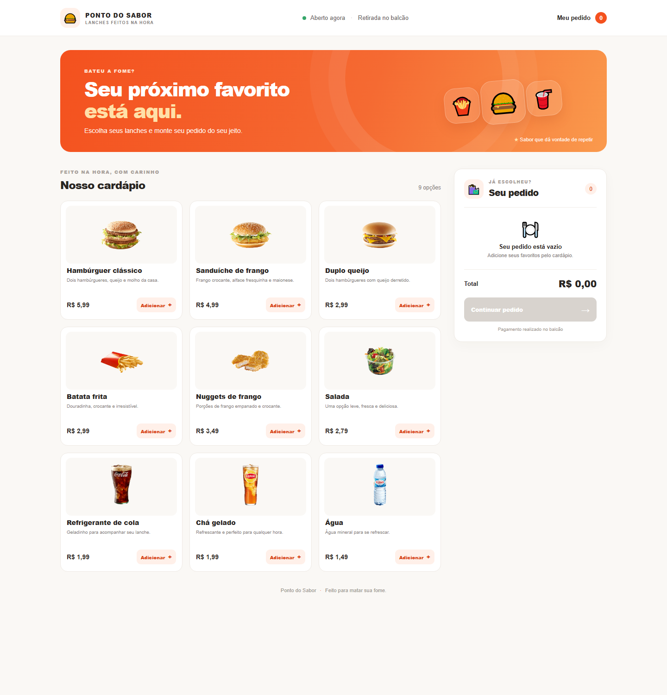
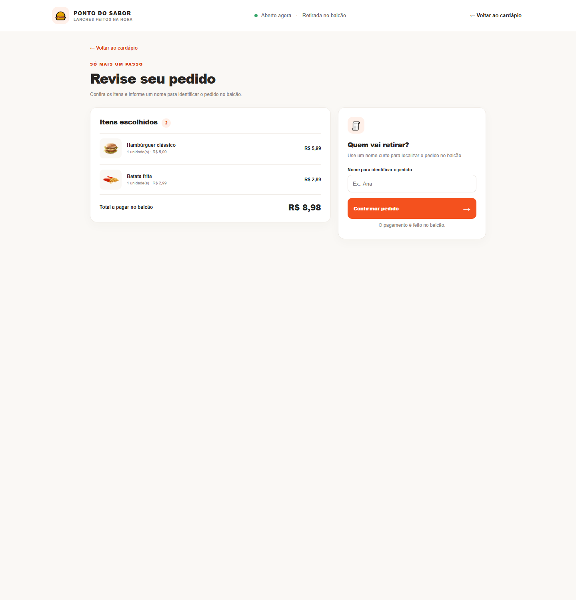
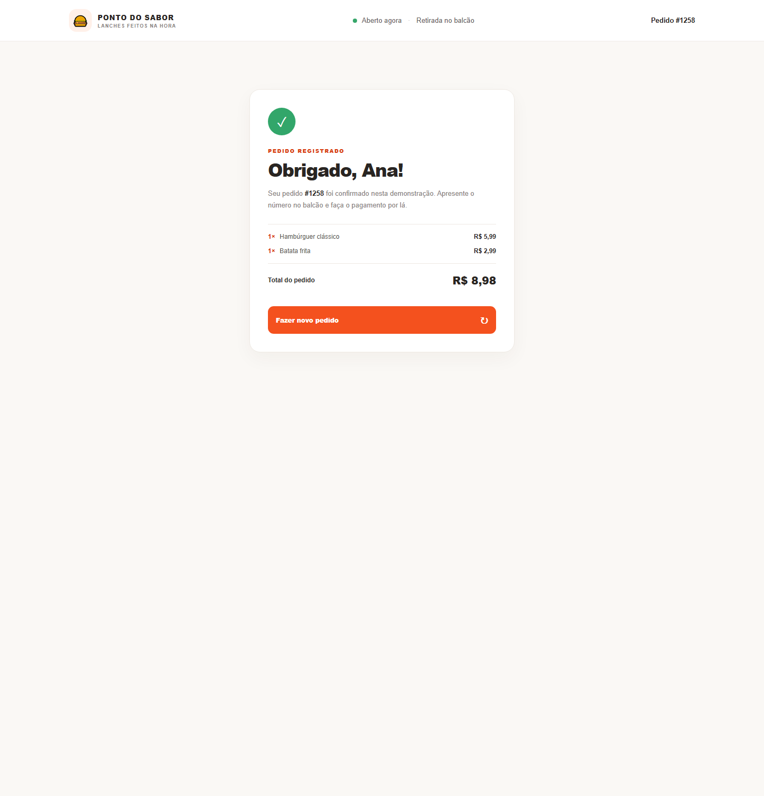

# Ponto do Sabor

Aplicação de autoatendimento para uma lanchonete. O cliente escolhe produtos, ajusta quantidades, revisa o pedido e informa um nome para identificá-lo no balcão. A interface foi construída com Vue 3 e Vite.

## Demonstração

As capturas mostram o cardápio, a revisão do pedido e a confirmação:

| Cardápio | Revisão do pedido |
| --- | --- |
|  |  |

| Pedido confirmado |
| --- |
|  |

## Funcionalidades

- Adição e remoção de produtos no pedido.
- Controle da quantidade de cada produto.
- Cálculo automático de subtotais e total em reais.
- Revisão dos itens e identificação do pedido por nome.
- Confirmação demonstrativa e opção para iniciar um novo pedido.
- Layout adaptável a telas de celular e computador.

## Tecnologias

- Vue 3 com componentes Single-File Components (`.vue`).
- Vite para desenvolvimento e build.
- CSS responsivo.

## Estrutura do projeto

```text
.
├── docs/
│   └── screenshots/
├── Project 1 - Vue 3/
│   ├── public/img/              # Imagens dos produtos
│   ├── src/
│   │   ├── assets/styles.css
│   │   ├── components/          # Cartão de produto e resumo do pedido
│   │   ├── data/products.js
│   │   ├── utils/formatPrice.js
│   │   ├── views/
│   │   │   ├── Home.vue
│   │   │   └── ConfirmarPedido.vue
│   │   ├── App.vue              # Estado e fluxo principal
│   │   └── main.js
│   ├── index.html
│   └── package.json
└── README.md
```

## Executar localmente

É necessário ter Node.js e npm instalados.

```powershell
cd "Project 1 - Vue 3"
npm install
npm run dev
```

Abra o endereço local exibido pelo Vite no terminal, normalmente `http://localhost:5173`.

Para gerar a versão de produção:

```powershell
npm run build
```

> A confirmação de pedido é demonstrativa: o projeto não possui backend e não envia pedidos para uma lanchonete.
